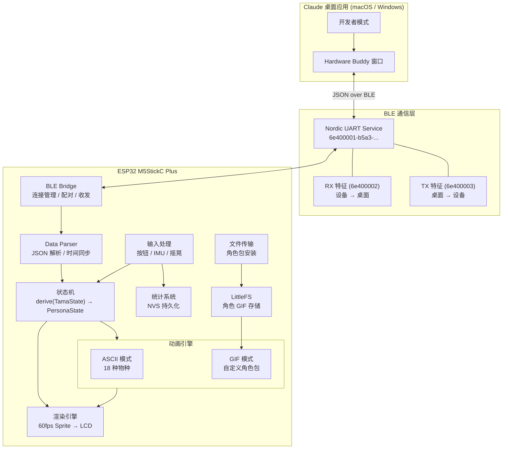
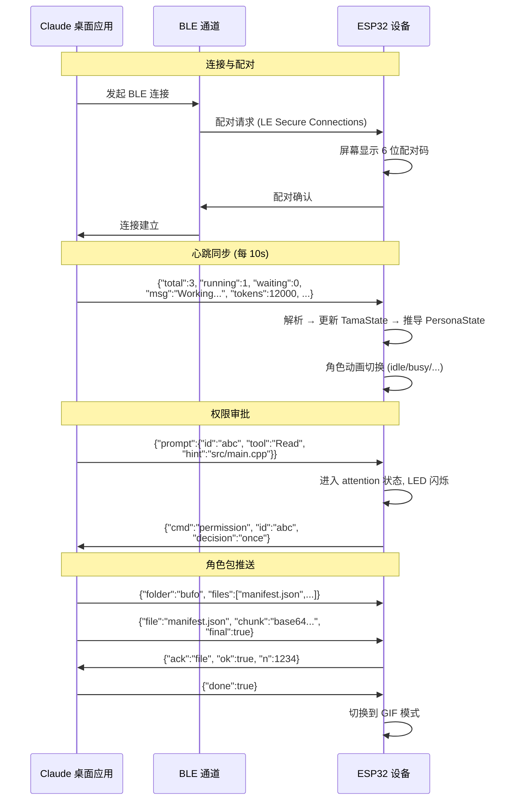
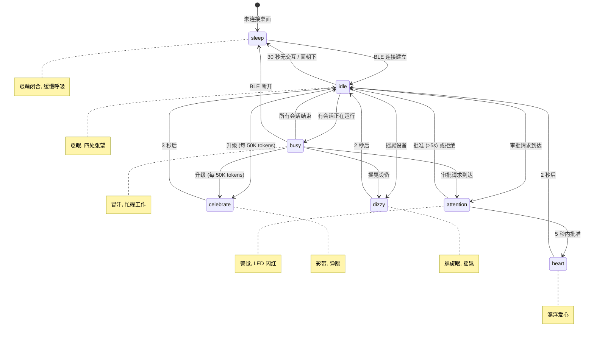
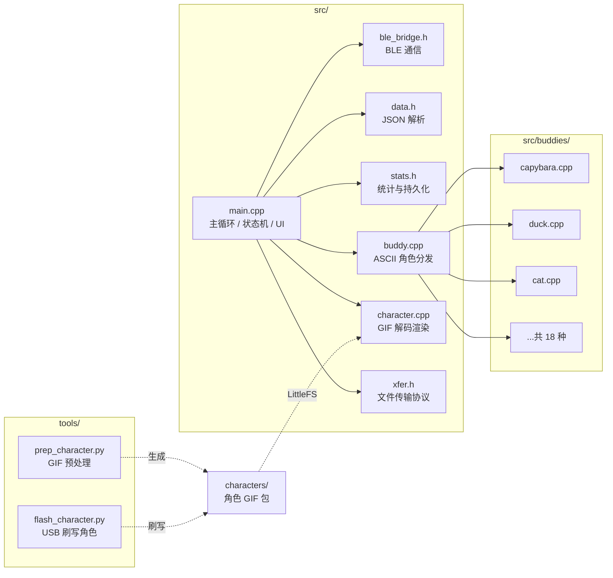
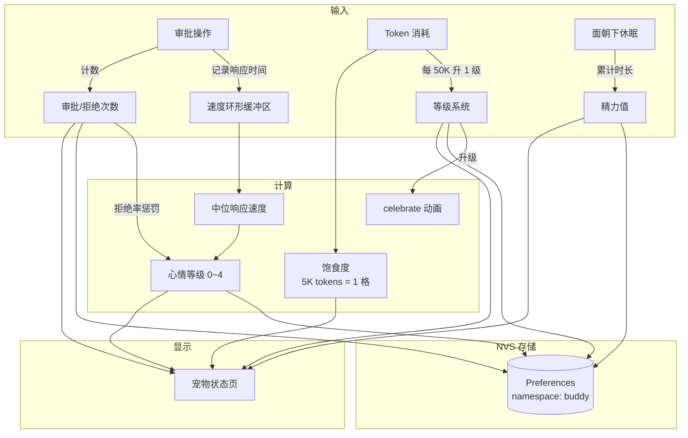
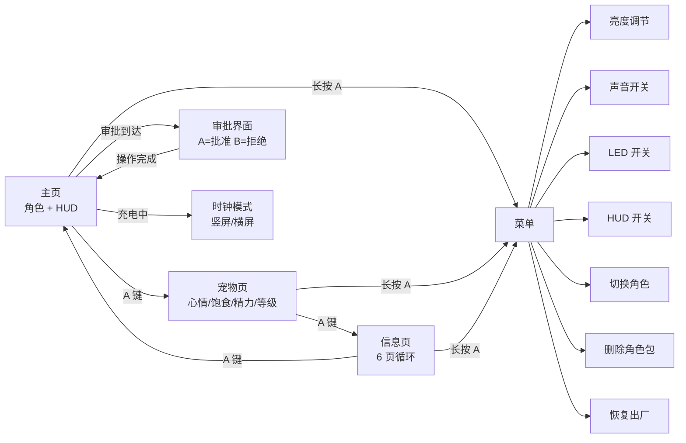
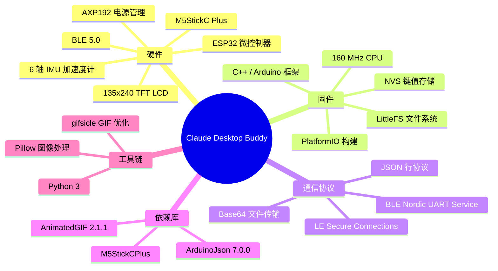
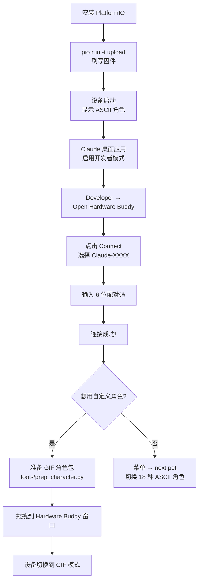

# Claude Desktop Buddy - 项目介绍

一款基于 ESP32 (M5StickC Plus) 的桌面宠物固件，通过 BLE（低功耗蓝牙）与 Claude 桌面应用（macOS / Windows）实时连接，将 Claude 的工作状态映射为可爱的动画角色。用户可以在硬件设备上直接审批权限请求、查看会话摘要，并通过互动积累统计数据与等级。

github: https://github.com/maidang-xing/claude-desktop-buddy.git

---

## 整体架构



---

## 数据流

桌面端与设备之间通过 BLE Nordic UART Service 以 JSON 行协议通信，支持双向数据交换：



---

## 状态机

设备根据桌面端推送的会话信息，推导出 7 种情绪状态，驱动角色动画：



---

## 核心模块



---

## 18 种 ASCII 角色

每种角色都实现了 7 种情绪状态的独立 ASCII 动画：

| 序号 | 角色 | 英文名 | 特色描述 |
|------|------|--------|----------|
| 1 | 水豚 | Capybara | 侧躺睡觉、打哈欠 |
| 2 | 鸭子 | Duck | 摇摆走路 |
| 3 | 鹅 | Goose | 张嘴嘎嘎叫 |
| 4 | 果冻 | Blob | Q 弹变形 |
| 5 | 猫 | Cat | 转头、竖耳 |
| 6 | 龙 | Dragon | 喷火、展翅 |
| 7 | 章鱼 | Octopus | 触手飘动 |
| 8 | 猫头鹰 | Owl | 转头、眨眼 |
| 9 | 企鹅 | Penguin | 扇翅、滑行 |
| 10 | 乌龟 | Turtle | 缩壳 |
| 11 | 蜗牛 | Snail | 缓慢移动 |
| 12 | 幽灵 | Ghost | 飘浮、隐现 |
| 13 | 蝾螈 | Axolotl | 鳃须飘动 |
| 14 | 仙人掌 | Cactus | 开花 |
| 15 | 机器人 | Robot | 天线闪烁 |
| 16 | 兔子 | Rabbit | 耳朵竖起 |
| 17 | 蘑菇 | Mushroom | 孢子飘散 |
| 18 | 胖猫 | Chonk | 圆滚滚的 |

---

## 统计与成长系统



**关键机制：**

- **等级**：每消耗 50,000 tokens 升 1 级，触发 celebrate 动画
- **心情**：基于审批响应速度中位数（越快心情越好），高拒绝率会降低心情
- **精力**：将设备面朝下进入"午睡"模式，累计休眠时长恢复精力条
- **饱食度**：由 token 消耗驱动，每 5,000 tokens 增加 1 格

---

## 显示模式与交互

设备提供多种显示界面，通过按钮切换：



---

## 技术栈



---

## 快速上手



---

## 项目目录结构

```
claude-desktop-buddy/
├── src/                          # 固件源码
│   ├── main.cpp                  # 主循环、状态机、UI 渲染 (1266 行)
│   ├── buddy.cpp / buddy.h       # ASCII 角色分发与渲染
│   ├── buddy_common.h            # 共享渲染工具、物种注册表
│   ├── ble_bridge.h              # BLE Nordic UART 通信
│   ├── data.h                    # JSON 解析、TamaState 数据结构
│   ├── stats.h                   # NVS 统计、等级、心情计算
│   ├── xfer.h                    # BLE 文件传输协议
│   ├── character.h / character.cpp  # GIF 角色加载与渲染
│   └── buddies/                  # 18 种 ASCII 角色实现
│       ├── capybara.cpp
│       ├── duck.cpp, cat.cpp, dragon.cpp ...
│       └── (每个约 150~200 行)
│
├── characters/                   # 示例 GIF 角色包
│   └── bufo/                     # bufo 蟾蜍角色
│       ├── manifest.json         # 角色配置 (颜色、状态映射)
│       └── *.gif                 # 各状态 GIF 动画
│
├── tools/                        # Python 工具
│   ├── prep_character.py         # GIF 预处理 (缩放、裁剪、优化)
│   └── flash_character.py        # USB 直接刷写角色包
│
├── docs/                         # 文档与截图
├── platformio.ini                # 构建配置
├── REFERENCE.md                  # BLE 线路协议完整规范
└── CONTRIBUTING.md               # 贡献指南
```

---

## 总结

Claude Desktop Buddy 是一个将 AI 工作流具象化的硬件项目。它通过 BLE 协议将 Claude 桌面应用的实时状态传递到一个小巧的 ESP32 设备上，让一个可爱的桌面宠物反映你的编程节奏 —— 忙碌时冒汗、等待审批时闪灯提醒、快速批准时飘出爱心。18 种内置 ASCII 角色 + 自定义 GIF 角色包，配合统计成长系统，让开发过程多了一份趣味与陪伴。
