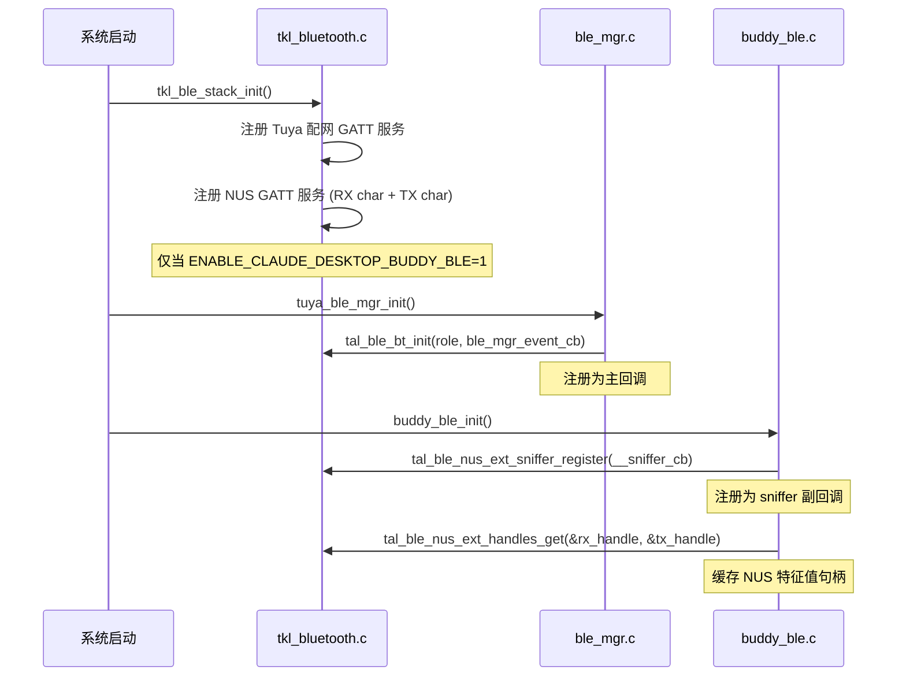
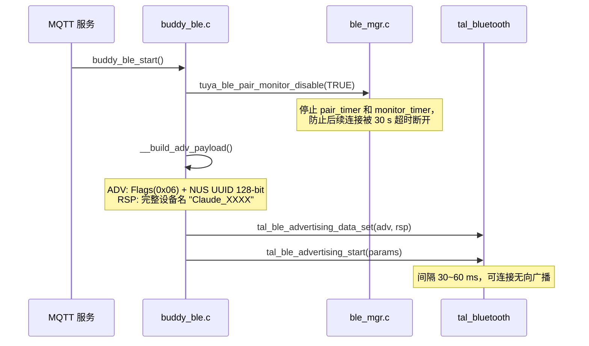
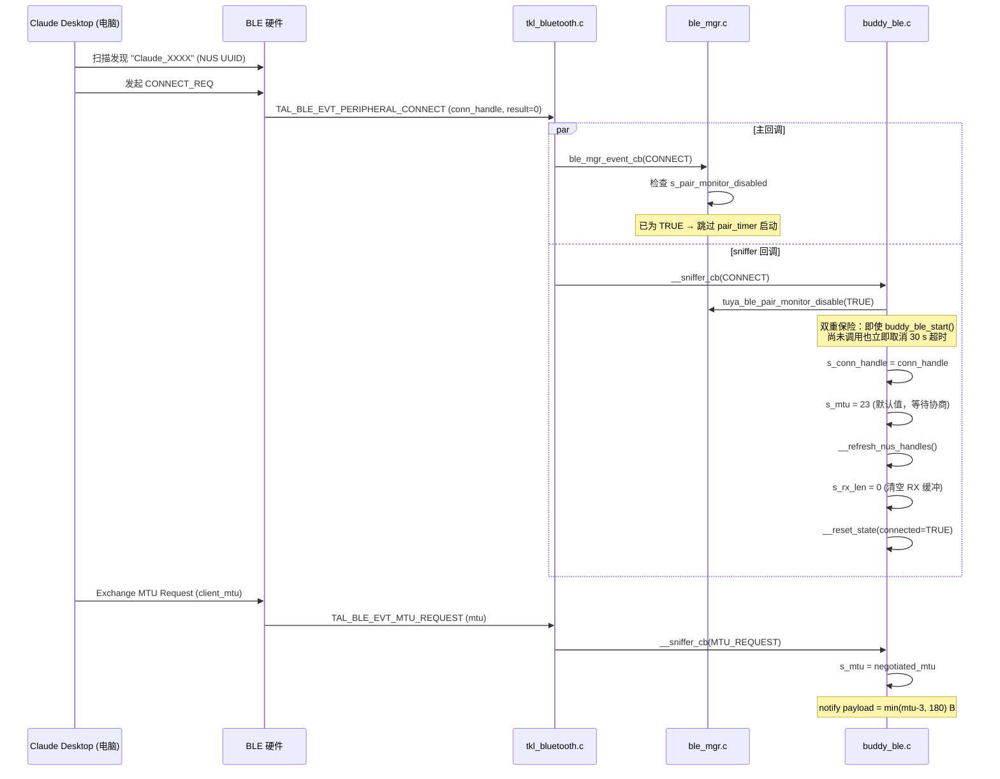
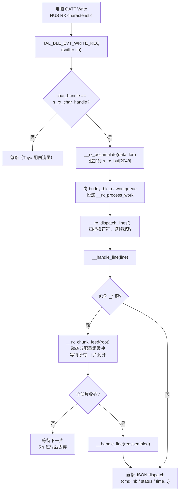
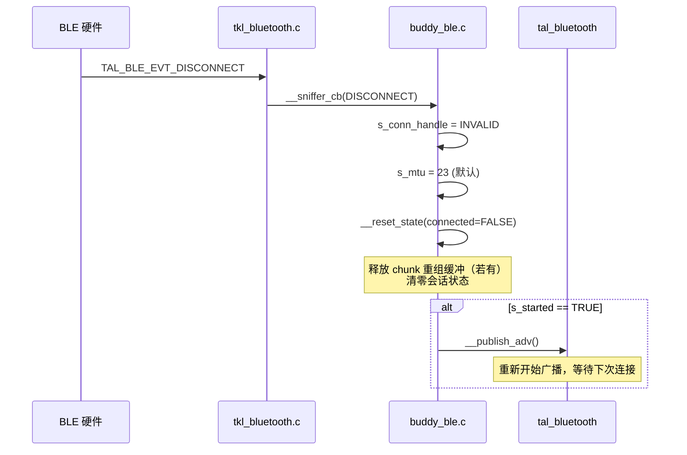

# BLE 连接流程文档

> 适用版本：buddy_ble.c v5.0 / TuyaOpen T5 Pocket Buddy

---

## 1. 总体架构

设备同时运行两套 BLE 角色：

| 角色 | 归属 | 用途 |
|------|------|------|
| Tuya 配网 GATT | `ble_mgr.c` | 设备绑定、DP 数据上报、配网 |
| Nordic UART Service (NUS) | `buddy_ble.c` | 与 Claude Desktop Buddy 通信 |

两套服务共用同一个 BLE 物理连接，在 `tal_bluetooth` 层通过**双回调机制**分发事件：

```
[BLE 硬件中断]
      │
      ▼
 tkl_bluetooth.c  ──── 主回调 ────►  ble_mgr.c (Tuya 配网)
      │
      └──────────── sniffer 回调 ──►  buddy_ble.c (NUS/Claude)
```

---

## 2. 启动与初始化

### 2.1 GATT 服务注册（单次，在系统启动时完成）



### 2.2 开始广播（MQTT 连接后触发）



**广播包格式：**

```
ADV Data (≤31 B):
  [02] [01] [06]           -- Flags: LE General Discoverable, BR/EDR Not Supported
  [11] [07] [NUS UUID 16B] -- Complete 128-bit UUID (NUS: 6E400001-...)

Scan Response (≤31 B):
  [len] [09] [Claude_XXXX] -- Complete Local Name
```

---

## 3. 连接建立



---

## 4. 数据通信

### 4.1 设备 → 电脑（TX 方向）

发送路径有两层分片：**应用层分块**（application chunking）和 **BLE 层分片**（notify fragmentation）。

```mermaid
flowchart TD
    A["应用调用<br/>buddy_ble_send_*(payload)"] --> B{"payload > 480 B?"}
    B -- 否 --> C["__send_raw(payload)"]
    B -- 是 --> D["__send_chunked(payload)"]

    D --> E["按 400 B 切分 payload\n构造 chunk 信封 JSON\n{\"_f\":\"XX\",\"_n\":N,\"_t\":T,\"_d\":\"...\"}"]
    E --> C

    C --> F["计算 BLE notify 分片大小\nchunk = min(mtu-3, 180)"]
    F --> G["循环调用\ntkl_ble_gatts_value_notify()\n每次 sleep 6 ms"]
    G --> H["电脑接收 BLE notify\n拼接 chunk 信封\n还原原始 payload"]
```

**应用层 chunk 信封格式（JSON，以换行 `\n` 结尾）：**

```json
{"_f":"a3","_n":1,"_t":3,"_d":"<base400B原始数据>"}
{"_f":"a3","_n":2,"_t":3,"_d":"<base400B原始数据>"}
{"_f":"a3","_n":3,"_t":3,"_d":"<剩余数据>"}
```

| 字段 | 含义 |
|------|------|
| `_f` | 帧 ID（0x00–0xFF 循环） |
| `_n` | 当前片序号（1-based） |
| `_t` | 本帧总片数 |
| `_d` | 原始数据片（JSON 转义） |

**BLE 层分片：**

```
MTU = 256 → notify payload = min(253, 180) = 180 B
一个 640 B chunk 信封 → ceil(640/180) = 4 个 BLE notify 包
```

### 4.2 电脑 → 设备（RX 方向）



**RX 缓冲保护机制：**

| 情况 | 处理方式 |
|------|----------|
| 单个写入包 ≥ 2048 B | 直接丢弃该包，日志 `rx frame too large` |
| 累计 + 新包 ≥ 2048 B | 清空缓冲（reset），日志 `rx overflow reset`，再追加 |
| 正常追加 | `memcpy` 追加，等待换行触发解析 |

---

## 5. 支持的命令帧

### 电脑 → 设备（设备接收）

| `cmd` | 说明 |
|-------|------|
| `hb` | Heartbeat，携带 Claude 当前状态（会话条目、时间等） |
| `status` | 查询设备状态，设备回复当前运行时信息 |
| `time` | 设置设备 RTC 时间 |
| `permission_response` | 对设备发出的权限请求进行应答 |

### 设备 → 电脑（设备发送）

| 函数 | 帧类型 | 说明 |
|------|--------|------|
| `buddy_ble_send_asr()` | `{"cmd":"asr","text":"...","sid":"..."}` | 语音识别结果 |
| `buddy_ble_send_hb_req()` | `{"cmd":"hb_req","page":"..."}` | 请求电脑推送最新状态 |
| `buddy_ble_send_permission_result()` | `{"cmd":"permission","id":"...","decision":"..."}` | 权限请求结果 |
| `buddy_ble_send_cmd()` | `{"cmd":"..."}` | 通用命令帧 |

---

## 6. 断连处理



---

## 7. Tuya 配网与 Claude 通道共存

两个通道在同一 BLE 连接上透明共存，互不干扰：

```
同一条 BLE 连接
  ├── Tuya 配网 GATT service
  │     Write → ble_mgr 主回调处理（加密配网协议）
  │
  └── NUS GATT service
        Write → sniffer 回调过滤 (char_handle == s_rx_char_handle)
        Notify ← buddy_ble 直接发送 (s_tx_char_handle)
```

**关键隔离点：**

1. `__sniffer_cb` 在 `TAL_BLE_EVT_WRITE_REQ` 中检查 `char_handle`，只处理 NUS RX 特征值的写入，其余全部透传给 Tuya 配网流程。
2. sniffer 回调**不得修改**事件 payload，只观察，不干扰 `ble_mgr` 状态机。
3. `tuya_ble_pair_monitor_disable(TRUE)` 在连接事件中立即调用，确保 Tuya 的 30 s 配对超时计时器不会误断 Claude 连接。

---

## 8. 内存布局

| 结构 | 位置 | 大小 | 说明 |
|------|------|------|------|
| `s_rx_buf` | heap | 2048 B | RX 行缓冲，`buddy_ble_init()` 分配 |
| `s_chunk_rx.buf` | heap（动态） | 按帧大小分配 | chunk 重组缓冲，帧完成或超时后释放 |
| `s_parse_snap` | BSS（静态） | ~6 KB | heartbeat 解析暂存，避免每次 malloc |
| `s_ui_snap` | BSS（静态） | ~6 KB | UI 刷新快照 |
| chunk 信封 `env[640]` | 栈 | 640 B | `__send_chunked()` 局部变量 |
| ASR 帧 `buf[1600]` | 栈 | 1600 B | `buddy_ble_send_asr()` 局部变量 |
| `buddy_ble_rx` workqueue 栈 | RTOS task | 6 KB | RX 处理线程 |
