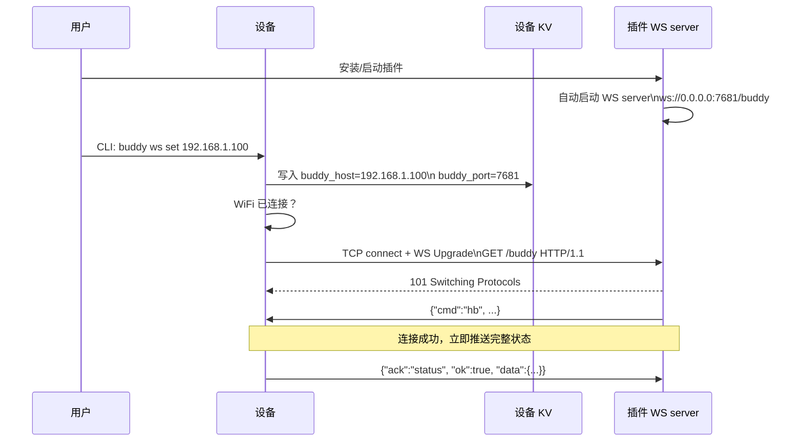
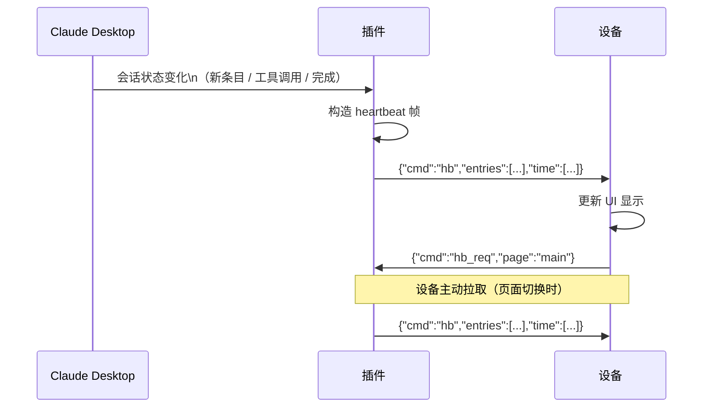
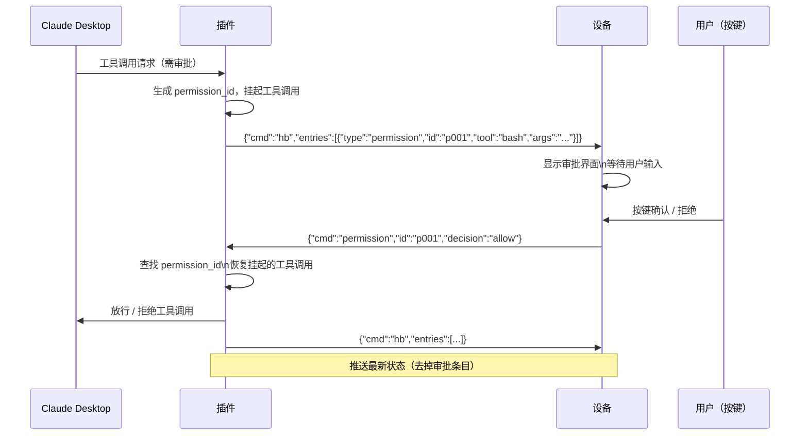
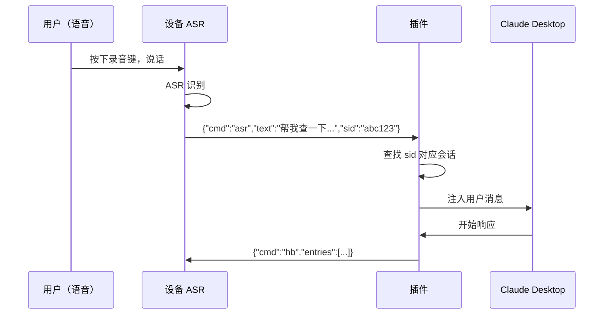
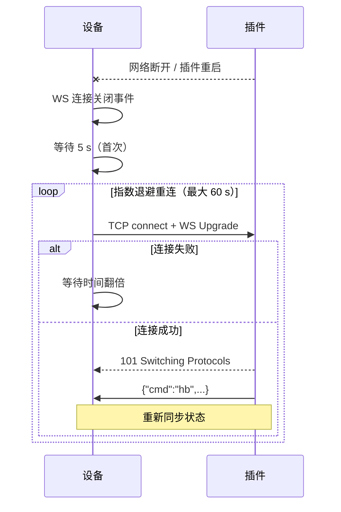

# WebSocket 替换 BLE 通信方案需求文档

> 项目：tuya_t5_pocket_buddy + Claude Desktop Buddy 插件
> 日期：2026-05-12
> 状态：待评审

---

## 1. 背景与目标

### 1.1 现状问题

当前 Buddy 应用通过 BLE NUS（Nordic UART Service）与电脑上的 Claude Desktop Buddy 插件通信，用于获取 Claude 会话状态并控制工具调用审批流程。该方案存在以下问题：

**设备侧：**
- NimBLE 主机栈占用 14 KB RTOS 栈，buddy_ble_rx workqueue 额外占用 6 KB
- BLE 有效吞吐率约 15 kbps（MTU=180 B/包 + 两层分片），大帧须依赖应用层 chunk 信封机制
- BLE 连接范围受限于物理近场，设备需要始终放置在电脑旁
- Tuya pair-timeout 机制需要额外 SDK 补丁才能与非 Tuya 对端共存

**插件侧：**
- 依赖操作系统蓝牙权限（macOS 需隐私授权，Windows 需配对），首次使用体验差
- BLE 设备扫描不稳定，受周围设备干扰
- 无法在远程桌面或 SSH 环境中使用

### 1.2 目标

用 WebSocket 长连接替换 BLE 通信，设备在 WiFi 已连接的前提下主动连接电脑，实现等价功能，同时：

- 显著降低设备 RTOS 资源占用
- 消除对操作系统 BLE 权限的依赖
- 提升连接稳定性和传输带宽

---

## 2. 需求概述

### 2.1 设备侧需求

| 编号 | 需求 |
|------|------|
| D-01 | 设备作为 WebSocket client，主动连接电脑上运行的 WS server |
| D-02 | 电脑 IP/端口由用户通过 CLI 命令输入，持久化存储在设备 KV |
| D-03 | WiFi 连接就绪后自动发起 WS 连接，断连后指数退避自动重连 |
| D-04 | 通信协议保持换行分隔 JSON，删除 BLE 专用的 chunk 信封层 |
| D-05 | 保留 Tuya BLE 配网功能不变，不影响设备初始化流程 |
| D-06 | 回退全部因 BLE NUS 引入的 src/ SDK 补丁，减少侵入性改动 |

### 2.2 插件侧需求

| 编号 | 需求 |
|------|------|
| P-01 | 插件启动时自动开启 WebSocket server，监听本机所有网口 |
| P-02 | 支持同一时刻多设备并发连接（至少 4 路） |
| P-03 | 设备连接后，立即推送一次完整 heartbeat 同步当前 Claude 状态 |
| P-04 | Claude 会话状态变化时，实时向所有已连接设备推送 heartbeat |
| P-05 | 接收设备发来的审批决策，映射到 Claude 对应的工具调用许可 |
| P-06 | 接收设备发来的 ASR 文本，作为用户输入注入 Claude |
| P-07 | 连接断开时清理该设备会话，不影响其他连接和 Claude 状态 |
| P-08 | 提供插件配置界面：端口号、是否自动启动 WS server |
| P-09 | 删除（或设为可选降级）原有 BLE 扫描/连接逻辑 |

---

## 3. 系统架构

### 3.1 现有架构（BLE）

```
[Claude Desktop]
      │  MCP / 内部 IPC
      ▼
[Claude Desktop Buddy 插件]
      │  BLE NUS（Nordic UART Service）
      │  GATT Write / Notify，MTU=256，有效 180 B/包
      ▼
[设备 buddy_ble.c]
  ├── sniffer callback（挂载在 tal_bluetooth 主回调旁）
  ├── buddy_ble_rx workqueue（6 KB 栈）
  ├── 应用层 chunk 重组（动态 heap）
  └── BLE notify 分片发送（两层）
```

### 3.2 目标架构（WebSocket）

```
[Claude Desktop]
      │  MCP / 内部 IPC
      ▼
[Claude Desktop Buddy 插件]
  ├── Claude 状态监听（已有）
  ├── 工具调用审批钩子（已有）
  ├── WS server（新增）ws://0.0.0.0:7681/buddy
  │     ├── 连接管理（多设备）
  │     ├── heartbeat 推送
  │     └── 审批决策路由
      │
      │  WebSocket 长连接（TCP，换行分隔 JSON）
      │
[设备 buddy_ws.c]
  ├── bk_websocket_client（平台层，已有）
  ├── KV 存储 host/port
  ├── 自动重连（指数退避）
  └── JSON 收发（无分片）
```

Tuya BLE 配网通道独立运行，不受影响：

```
[Tuya App]──BLE 配网──►[设备]──WiFi──►[Tuya 云 MQTT]
                                  │
                                  └── WiFi 就绪 ──► buddy_ws.c 发起 WS 连接
                                                          │
                                             [电脑 Claude Desktop Buddy 插件]
```

---

## 4. 完整交互流程

### 4.1 首次配置与连接建立



### 4.2 Claude 状态同步（心跳）



### 4.3 工具调用审批流程



### 4.4 语音输入流程



### 4.5 断连与重连



---

## 5. 通信协议

### 5.1 传输层对比

| 项目 | BLE 方案 | WebSocket 方案 |
|------|----------|----------------|
| 传输协议 | BLE GATT Notify / Write | WebSocket Text Frame（TCP） |
| 帧边界 | BLE ATT MTU 分片 + 应用层 chunk 信封 | 换行符 `\n`（TCP 流天然有序） |
| 最大帧大小 | ~8 KB（chunk 上限） | 不限（受 WS buffer 配置约束） |
| 吞吐率 | ~15 kbps | ~1 Mbps（本地 WiFi） |
| 延迟 | 连接间隔 30~60 ms | <5 ms（局域网） |
| 分片层 | 两层（BLE ATT + 应用 chunk） | 无，直接发送 |

### 5.2 帧格式（双向，换行分隔 JSON）

**插件 → 设备：**

| 帧类型 | 格式 | 触发时机 |
|--------|------|----------|
| heartbeat | `{"cmd":"hb","entries":[...],"time":[sec,min,hr,day,mon,yr]}` | 连接建立、状态变化、响应 hb_req |
| 时间同步 | `{"cmd":"time","ts":1700000000}` | 设备请求或定时推送 |
| 审批响应 | `{"cmd":"permission_response","id":"xxx","ok":true}` | 用户在插件侧操作（可选） |
| 状态查询 | `{"cmd":"status"}` | 插件主动查询设备 |

**设备 → 插件：**

| 帧类型 | 格式 | 触发时机 |
|--------|------|----------|
| ASR 结果 | `{"cmd":"asr","text":"...","sid":"..."}` | 语音识别完成 |
| 状态拉取 | `{"cmd":"hb_req","page":"main"}` | 设备页面切换 |
| 审批决策 | `{"cmd":"permission","id":"xxx","decision":"allow"}` | 用户按键确认/拒绝 |
| 命令 | `{"cmd":"..."}` | 通用控制帧 |
| 状态响应 | `{"ack":"status","ok":true,"data":{"name":"...","sys":{"up":123}}}` | 响应 status 查询 |

> **删除**：BLE 方案中的 chunk 信封（`_f/_n/_t/_d`）字段在 WS 方案中不再需要，双端均可删除相关解析逻辑。

### 5.3 连接标识

WS 握手时设备通过 HTTP Header 携带自身信息，供插件区分多设备：

```
GET /buddy HTTP/1.1
Host: 192.168.1.100:7681
X-Buddy-Name: Claude_A3F2
X-Buddy-Version: 5.0
```

---

## 6. 设备侧实现

### 6.1 文件变动

| 操作 | 文件 |
|------|------|
| 新增 | `buddy_ui/buddy_ws.c` |
| 新增 | `buddy_ui/buddy_ws.h` |
| 删除 | `buddy_ui/buddy_ble.c` |
| 删除 | `buddy_ui/buddy_ble.h` |
| 删除 | `src/tal_bluetooth/include/tal_bluetooth_nus_ext.h` |

### 6.2 公共接口（与 buddy_ble 保持签名兼容）

```c
OPERATE_RET buddy_ws_init(void);
OPERATE_RET buddy_ws_start(void);
OPERATE_RET buddy_ws_send_asr(const char *text);
OPERATE_RET buddy_ws_send_hb_req(const char *page);
OPERATE_RET buddy_ws_send_permission_result(const char *id, const char *decision);
OPERATE_RET buddy_ws_send_cmd(const char *cmd);
```

### 6.3 SDK 补丁回退

| 文件 | 现有改动 | 回退 |
|------|----------|------|
| `src/tuya_cloud_service/ble/ble_mgr.c` | `s_pair_monitor_disabled` + `tuya_ble_pair_monitor_disable()` | 删除，恢复原始 |
| `src/tuya_cloud_service/ble/ble_mgr.h` | `tuya_ble_pair_monitor_disable()` 声明 | 删除 |
| `src/tal_bluetooth/nimble/include/tuya_ble_os_adapter.h` | BLE host stack 4 KB → 14 KB | 回退 4 KB |
| `src/tal_bluetooth/nimble/tkl_bluetooth.c` | NUS GATT 注册、sniffer、deinit 补丁 | 删除 |

关闭 Kconfig `ENABLE_CLAUDE_DESKTOP_BUDDY_BLE`，以上代码不再参与编译。

### 6.4 资源对比

| 资源 | BLE 方案 | WS 方案 | 节省 |
|------|----------|---------|------|
| NimBLE host stack | 14 KB | 0 | **14 KB** |
| buddy_ble_rx workqueue | 6 KB | 4 KB | **2 KB** |
| chunk 重组 heap | 动态（帧大小） | 删除 | **节省** |
| TX chunk 信封栈 | 640 B/次 | 删除 | **节省** |
| BLE ADV 广播 CPU | 持续 | 删除 | **节省** |
| RX 行缓冲 | 2 KB | 2 KB | 持平 |
| 静态解析缓冲 | ~6 KB BSS | ~6 KB BSS | 持平 |

### 6.5 IP 配置方式

**CLI（主要方式）：**

```
buddy ws set 192.168.1.100        # 默认端口 7681
buddy ws set 192.168.1.100 8080   # 指定端口
buddy ws status                    # 显示连接状态和对端信息
```

**UI 数字键盘（可选）：**  
新增 IP 输入屏幕，适合无串口调试的场景，通过方向键逐位选择 IP 数字，写入 KV 后立即重连。

---

## 7. 插件侧实现

### 7.1 现有功能（不变）

- 通过 MCP 或内部 IPC 监听 Claude Desktop 会话事件（新消息、工具调用、完成）
- 工具调用审批钩子：拦截需要审批的工具调用，挂起等待外部决策
- heartbeat 帧构造：将当前会话条目序列化为 JSON
- BLE 通信模块（迁移后降级为可选/删除）

### 7.2 新增：WebSocket Server 模块

#### 7.2.1 架构

```
插件进程
├── Claude 状态监听（已有）
├── 审批钩子（已有）
└── BuddyWsServer（新增）
      ├── listen(0.0.0.0:7681)
      ├── DeviceSession × N（每连接一个）
      │     ├── 接收队列（异步）
      │     └── 发送队列（异步）
      └── 事件分发
            ├── onConnect   → 推送初始 heartbeat
            ├── onMessage   → 路由到对应处理器
            └── onDisconnect→ 清理会话
```

#### 7.2.2 连接管理

| 事件 | 行为 |
|------|------|
| 设备连接 | 创建 `DeviceSession`，记录 `X-Buddy-Name`；推送完整 heartbeat |
| 设备断连 | 销毁 `DeviceSession`；若有挂起审批，保留等待（超时后自动拒绝） |
| 插件关闭 | 向所有连接设备发送 WS Close 帧，关闭 server socket |
| 插件重启 | 重新 bind 端口（设备侧自动重连） |

支持并发连接上限可配置，默认 4 路。同一设备（相同 `X-Buddy-Name`）重连时，旧 session 自动替换。

#### 7.2.3 消息处理

**收到设备消息：**

```
设备帧                      插件行为
─────────────────────────────────────────────────────
cmd=asr                 →  将 text 注入 Claude 当前会话
cmd=hb_req              →  立即推送最新 heartbeat
cmd=permission          →  查找 id 对应的挂起审批，执行决策
ack=status              →  更新该设备的在线状态记录（可选展示）
```

**向设备发送：**

```
触发条件                     发送内容
─────────────────────────────────────────────────────
设备连接                 →  完整 heartbeat（所有当前条目）
Claude 新消息/工具调用   →  增量或完整 heartbeat（取决于变化量）
新审批请求               →  包含 permission 条目的 heartbeat
审批完成                 →  去除 permission 条目的 heartbeat
定时（可选，30 s）       →  {"cmd":"time","ts":...} 时间同步
```

#### 7.2.4 审批决策流程

```
1. Claude 触发工具调用，审批钩子拦截
2. 生成唯一 permission_id，记录 {id → Promise/回调, tool, args, timeout}
3. 构造 heartbeat（含 type=permission 条目），广播给所有设备
4. 等待：
   a. 设备发来 {cmd:permission, id, decision} → 执行决策，resolve Promise
   b. 超时（可配置，默认 60 s） → 自动拒绝，清理记录
5. 通知 Claude 继续（放行）或终止（拒绝）
6. 推送更新后的 heartbeat（permission 条目消失）
```

#### 7.2.5 ASR 注入流程

```
1. 收到 {cmd:asr, text, sid}
2. 校验 sid：匹配当前活跃会话 ID（防止过期帧）
3. 将 text 作为用户消息提交到 Claude Desktop 当前输入框
4. 返回 {ack:"asr","ok":true}（可选）
```

### 7.3 配置项

| 配置项 | 默认值 | 说明 |
|--------|--------|------|
| `ws.enabled` | `true` | 是否启用 WS server |
| `ws.port` | `7681` | 监听端口 |
| `ws.autoStart` | `true` | 插件启动时自动开启 |
| `ws.maxDevices` | `4` | 最大并发连接数 |
| `ws.permissionTimeout` | `60` | 审批超时秒数 |
| `ws.timeSyncInterval` | `30` | 时间同步推送间隔（秒），0=禁用 |

### 7.4 文件变动（参考结构，取决于插件实现语言）

```
src/
├── transport/
│   ├── ble-transport.ts        ← 已有，降级为可选
│   └── ws-server.ts            ← 新增：WS server + DeviceSession
├── handlers/
│   ├── permission-handler.ts   ← 已有，新增 WS 路由入口
│   └── asr-handler.ts          ← 新增
├── buddy-server.ts             ← 新增：统一管理 WS server 生命周期
└── config.ts                   ← 新增 ws.* 配置项
```

---

## 8. 约束与风险

| 约束/风险 | 说明 | 缓解措施 |
|-----------|------|----------|
| 同一局域网要求 | 设备和电脑须在同一 WiFi 网络 | 设备已接 WiFi（MQTT 必要条件），通常自然满足 |
| 电脑 IP 变化 | DHCP 重新分配导致设备重连失败 | 建议电脑设置静态 IP；后续可用 mDNS 自动发现 |
| 无传输加密 | `ws://` 明文，局域网内可嗅探 | 局域网内可接受；敏感场景升级为 `wss://`（需 mbedtls） |
| 审批超时无响应 | 设备下线后挂起审批无法完成 | 超时自动拒绝（默认 60 s），并在插件 UI 提示 |
| `bk_websocket_client` 平台绑定 | 该库为 T5AI 平台私有 | 仅影响此平台；其他平台可换用 `libhttp` WS 实现 |
| 端口冲突 | 7681 已被其他服务占用 | 插件配置界面支持修改端口 |
| 首次使用需手动输入 IP | 体验略繁琐 | 后续优化：UDP 广播自动发现插件地址 |

---

## 9. 里程碑

### 设备侧

| 阶段 | 任务 | 范围 |
|------|------|------|
| D-M1 | 实现 `buddy_ws.c`：KV 配置、WS 连接、自动重连、JSON 收发 | 应用层 |
| D-M2 | 迁移全部公共接口（asr / hb_req / permission / cmd / status） | 应用层 |
| D-M3 | 添加 CLI 命令 `buddy ws set/status` | 应用层 |
| D-M4 | 删除 chunk 信封层（`__send_chunked` / `__rx_chunk_feed`） | 应用层 |
| D-M5 | 回退 src/ SDK 补丁，关闭 `ENABLE_CLAUDE_DESKTOP_BUDDY_BLE` | SDK |

### 插件侧

| 阶段 | 任务 | 范围 |
|------|------|------|
| P-M1 | 实现 `BuddyWsServer`：listen、DeviceSession、连接管理 | 插件 |
| P-M2 | 实现 heartbeat 推送：连接时全量、状态变化时增量 | 插件 |
| P-M3 | 实现审批路由：permission 帧收发、超时自动拒绝 | 插件 |
| P-M4 | 实现 ASR 注入：文本提交到 Claude，sid 校验 | 插件 |
| P-M5 | 实现配置界面（端口、开关、超时参数） | 插件 |
| P-M6 | 降级/删除 BLE 通信模块 | 插件 |

### 联调

| 阶段 | 任务 |
|------|------|
| E-M1 | 端到端连接建立 + heartbeat 展示验证 |
| E-M2 | 审批流程全链路验证（放行 / 拒绝 / 超时） |
| E-M3 | ASR 注入 + Claude 响应验证 |
| E-M4 | 断连重连稳定性压测（循环断网 100 次） |
